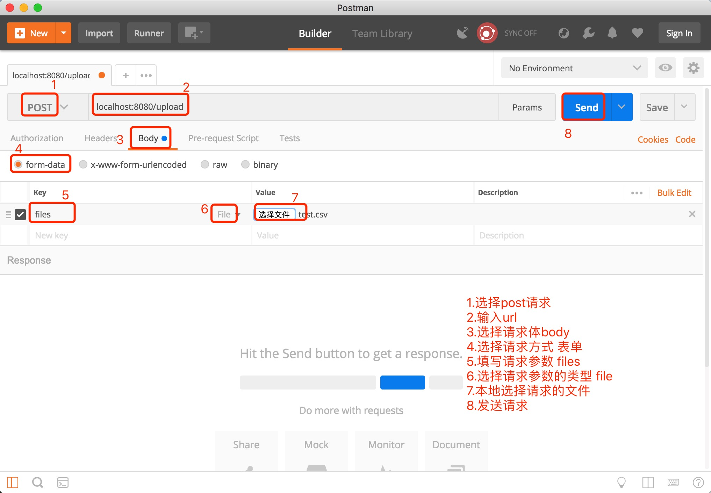

# data-import

#### 项目介绍
网上搞到了2000w的.csv数据，想导入到数据库，但是数据量太大，直接用命令导入不太现实。另外存在很多脏数据。命令导入操作太繁琐。

所以，写了一个基于SSM的数据导入。利用springMVC的文件上传功能，然后对文件进行解析，过滤脏数据，批量导入数据库。 平均200W数据导入大概需要6分钟。

我的想法是，使用线程池开启多个线程导入。

- 1.但是多个线程读取一个文件，这样肯定不行。 
- 2.就算多个线程可以读取，那么每个线程获取的数据都一样的，我需要保证插入的数据不重复。 
- 3.暂时的想法是，一个线程对文件进行解析，javaIO读取文件速度很快。然后开启多个线程导入数据库。 
- 4.不过，我没有成功，待需要的时候在研究。

#### 软件架构
软件架构说明

#### 安装教程

- 1. 配置数据库连接，jdbc.properties
- 2. 自己创建数据表的mapper，entity，dao
- 3. 启动程序

#### 使用说明

- 1.启动程序
- 2.使用postman模拟请求
    
- 3.可以再控制台查看日志

